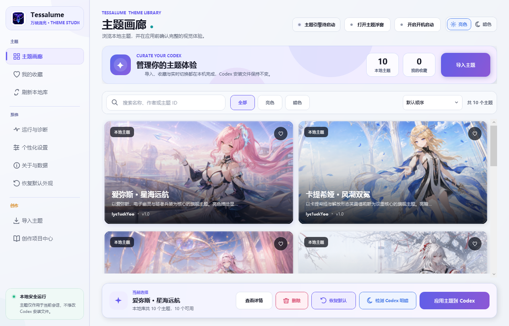
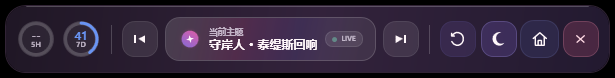
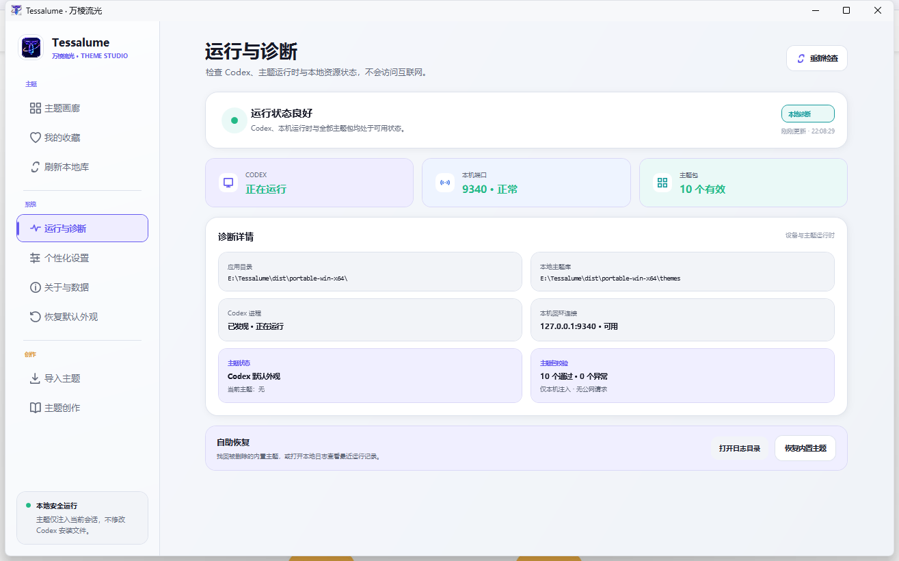

# Tessalume · 万棱流光

面向 Codex Desktop 的开源 Windows 主题工作室。Tessalume 把完整沉浸式主题、项目化创作、实时体检、亮暗预览、安全分享、便携备份、本机诊断和官方自动更新集中在一个应用中；主题运行通过本机回环端口连接 Codex，不修改 Codex 安装包、`app.asar` 或用户数据。

[下载 Tessalume 1.3.0](https://github.com/lyc1uckYoo/tessalume/releases/latest) · [问题反馈](https://github.com/lyc1uckYoo/tessalume/issues/new?template=bug-report.yml) · [版本记录](CHANGELOG.md) · [主题制作指南](THEMING.md) · [安全与隐私](SECURITY.md) · [MIT 许可证](LICENSE)

<picture>
  <source media="(prefers-color-scheme: dark)" srcset=".github/assets/screenshots/tessalume-dark.png">
  <source media="(prefers-color-scheme: light)" srcset=".github/assets/screenshots/tessalume-light.png">
  
</picture>

## Tessalume 1.3.0

1.3 把“一句话生成主题”扩展为完整的创作与维护闭环。软件会记录最近工作区、自动发现主题项目、按清单/入口/素材/亮暗预览/Template 1.0 等维度提供结构化体检，并在文件稳定后自动刷新。通过体检的项目可以重新应用到 Codex、切换亮暗状态，并导出带 SHA-256 的确定性分享 ZIP。

这一版同时补齐便携数据备份/恢复与兼容性健康记录。恢复前会校验内容并自动快照当前状态，失败时回滚；Codex 或运行时版本变化后会重新预检，并把失败定位到明确阶段，避免多个 Codex 页面留下不一致的半注入状态。

1.2.0 与 1.2.1 用户可以直接通过软件自动更新到 1.3.0。更新只替换 EXE，原有主题、收藏、图像参数、工作区和自动更新设置都会保留；旧配置会迁移到 Schema 2，并在迁移前保存一份本地原始快照。

## 主要功能

- **完整主题画廊**：统一管理角色横幅、聊天背景、消息框、卡片、输入框挂件和专属动效，不只是替换颜色。
- **十套内置旗舰主题**：10 款主题全部随 EXE 发布，均支持亮色和暗色，并遵循同一套 Template 1.0 结构、自适应规则与运行时契约。
- **主题详情与智能排序**：可按名称、说明、作者或主题 ID 搜索，按亮色/暗色能力筛选，并按默认顺序、最近使用、名称或作者排列；详情页会并排展示真实亮暗预览、主题说明、Template、文件信息和本地目录。
- **收藏与快速切换**：收藏喜欢的主题，在主界面或顶部浮窗中直接切换；恢复默认外观后，也可以一键回到刚才使用的主题。
- **Codex 明暗模式控制**：Tessalume 自身和 Codex 的亮暗模式分别控制，浮窗会显示 Codex 当前状态。
- **高级图像调节**：首页横幅、左栏人物和聊天背景提供“基础 / 构图 / 效果”三组控制，可调整亮度、对比度、饱和度、不透明度、缩放、水平/垂直位置、灰度、色相与柔化；支持精确输入、键盘微调、撤销/重做、按住查看原图、区域复制、亮暗参数复制和个人方案。个人方案可以导出为纯参数文件并在其他 Tessalume 中导入复用；每个主题的亮色与暗色参数独立保存，默认保持原图与主题原始裁切。
- **本地主题导入**：可选择或直接拖入主题文件夹/ZIP 压缩包，导入包含 `manifest.json`、`skin.css`、`theme.js` 和本地资源的完整主题；同 ID 覆盖前会比较版本并提示升级、同版覆盖或降级，收藏和图像参数继续保留。
- **项目化主题创作**：创建或打开 Codex 创作者工作区，自动发现 `themes/` 下的项目，记录最近工作区，并集中显示角色、版本、素材、更新时间和项目健康状态。
- **角色提示词生成器**：填写作品、角色、视觉方向、参考图和额外要求，即可生成包含角色研究、11 张素材确认、亮暗覆盖、Template 1.0 契约和最终校验的完整 Codex 提示词；草稿只保存在本机。
- **创作者工作区维护**：自动识别工作区模板版本；旧工作区可安全升级 Tessalume 管理的 Skill、Schema、说明和共享模板，替换前自动备份，且始终不会改动 `themes/` 中的用户项目。
- **结构化主题体检**：按清单、入口、11 张素材、亮暗预览、Template 1.0、CSS、脚本与资源引用分组展示错误、警告、通过项和明确修复建议。
- **稳定实时开发**：只监听项目声明的清单、CSS、JS 与素材；连续保存、原子替换和大图片写入稳定后再重新体检。自动应用为会话级开关，默认关闭。
- **安全分享 ZIP**：通过体检的项目可导出确定性 ZIP；导出前二次校验，排除设计源文件、日志和缓存，并显示文件数、大小与 SHA-256。导出包会由 Tessalume 自己回读确认可重新导入。
- **便携备份与恢复**：默认备份收藏、图像参数和运行状态，可选包含用户导入主题；恢复前展示摘要并自动快照，失败时回滚，日志、更新文件和内置主题不会进入备份。
- **兼容性健康记录**：诊断页显示 Codex 版本、主题运行时契约、最近成功时间和失败阶段；环境变化后首次应用自动预检，并给出对应恢复建议。
- **便携数据与开机启动**：主题、收藏、运行状态和界面设置都保存在 `Tessalume.exe` 旁边；开机启动默认关闭，只有用户主动开启后才写入当前 Windows 用户的启动项，不需要管理员权限。
- **完整自动更新**：默认定期检查官方 GitHub Releases，也可在设置页手动检查；新版本会展示说明，经确认后下载、校验 SHA-256、备份旧 EXE、安全替换并自动重新启动，失败时保留当前版本。
- **恢复与诊断**：随时恢复 Codex 默认外观或找回误删的内置主题；诊断页会直接显示 Codex 进程、本机端口、主题包和当前运行状态，并可打开本地日志目录。
- **单实例续接**：重复运行 `Tessalume.exe` 不会创建第二套后台状态，而是唤起已经运行的主界面。
- **缩放与键盘操作**：主界面会适应小屏幕和 Windows 高 DPI；可用 `Ctrl+F` 搜索、`Ctrl+I` 导入文件夹、`Ctrl+Shift+I` 导入 ZIP、`F5` 刷新主题库，主题详情可用 `Esc` 关闭。

## 顶部主题浮窗

Tessalume 默认以顶部浮窗开始工作。浮窗常驻屏幕上方，不遮挡 Codex 的主要内容，提供：

- Codex **5 小时额度**与**长周期额度**剩余比例，信息可用时每分钟刷新；
- 上一个、下一个主题切换：有收藏时仅在收藏主题间切换，没有收藏时使用全部有效主题；
- 当前主题和运行状态；
- 恢复 Codex 默认外观，或重新应用刚才使用的主题；
- Codex 亮色/暗色切换；
- 打开 Tessalume 主界面与关闭浮窗。



如果 Codex 暂时没有返回某个额度，圆环会显示 `--`，不会阻塞主题切换。点击浮窗中的主页按钮，或再次运行 `Tessalume.exe`，即可打开完整主题画廊。

## 当前内置主题

| 主题 | 包 ID | 亮暗形态与主题特征 |
|---|---|---|
| 爱弥斯 · 星海远航 | `aemeath.star-voyage` | 星炬学院晨光 / 隧者核心深空，包含机制同步面板与专属长剑「永远的启明星」 |
| 卡提希娅 · 风潮双冕 | `cartethyia.gale-tide-crown` | 游侠逐风 / 芙露德莉斯解放形态，以风潮王冠、三柄剑影、黑潮荆棘和鸢尾花瓣构成双形态组件 |
| 达妮娅 · 泡影虚阈 | `danya.bubble-void-duality` | 泡泡剧场伪装形态 / 寂静虚阈真形，保留双形态角色组件与专属动效 |
| 绯雪 · 常世预见 | `hiyuki.crimson-snow` | 晨雪守愿 / 冰蓝预见，包含愿望档案、常世与预见双卡、预见铃阵及迅刀「霙霜」 |
| 尤诺 · 月弦逆命 | `iuno.moonbow-defiance` | 新月月弓 / 弦月月环，以四方殿星历、月相历盘与逆写命运构成完整视觉系统 |
| 清宵 · 云门剑境 | `qingxiao.cloudsword-gate` | 行剑云关 / 抚弦布阵，包含天地弦心剑、万剑归弦、云门剑痕消息框与玉案记忆组件 |
| 守岸人 · 泰缇斯回响 | `shorekeeper.tethys-reverie` | 镜海晨曦 / 概率之海，包含潮汐演算、双卡交替与专武「星序协响」 |
| 穗穗 · 朝晖山水卷 | `suisui.inkscape-dawn` | 朝晖山河长卷 / 夜色水墨境，包含栖霞饮露扇、重明双卡、昆明记忆水镜与流金消息框 |
| 心 · 朝月孤城 | `xin.moonfox-sovereign` | 白玉云宫 / 赤月黑城，人形与白狐本体、红玉岁序结界和双角色卡交替动效 |
| 秧秧 · 苍翎远音 | `yangyang.xuanling-echo` | 温柔清雪 / 玄方夜战，包含苍翎六音、苍剑与翎剑式、秧秧和玄翎鸟双卡及风轨动效 |

10 款内置主题的主题包版本与旗舰模板契约均为 `1.0`，同时支持亮色与暗色。程序根据 Tessalume 当前模式自动使用对应预览，应用后可以直接在浮窗中切换 Codex 明暗形态。

## 下载与使用

1. 从 [Releases](https://github.com/lyc1uckYoo/tessalume/releases/latest) 下载 `Tessalume.exe`。
2. 将 EXE 放入一个可写的独立文件夹，不要直接在压缩包或临时下载目录中运行。
3. 运行 `Tessalume.exe`。程序是包含 .NET 运行时的 Windows x64 自包含单文件，不需要另行安装 .NET。
4. 首次启动会在程序旁创建并维护以下便携目录：

   ```text
   Compatibility/   本机主题运行适配
   Templates/       旗舰主题模板 1.0
   data/            收藏、运行状态与界面设置
   themes/          内置主题和自行导入的主题
   ```

5. 首次启动会先显示欢迎引导，不会自动应用主题或中断正在运行的 Codex。进入主题库后，由你选择想使用的主题。
6. 在主界面选择主题并点击“应用主题到 Codex”。需要重新启动 Codex 时，软件会先提醒保存当前工作并等待确认；连接成功后即可通过浮窗实时切换。

开启自动检查后，软件每次启动都会检查一次官方 Releases；发现新版本时，左上角品牌区会出现红色“更新”提示，点击后才展示版本说明并进入下载与安装确认。可在“个性化设置 → 软件自动更新”关闭自动检查，手动检查始终可用。更新仅替换 `Tessalume.exe`，不会删除 `data/`、用户主题或个性化参数。

### 从 1.2.x 升级到 1.3.0

打开“个性化设置 → 软件自动更新”，点击“立即检查”；确认版本说明后，Tessalume 会下载并校验 `1.3.0`、备份旧 EXE、安全替换并重新启动。整个过程不会删除程序旁边的 `data/`、`themes/`、`Compatibility/`、`Templates/` 或创作工作区。首次读取旧设置时会迁移为 Schema 2，并在 `data/backups/` 保存迁移前快照。

### 从 1.1 升级到 1.2

1. 退出正在运行的 Tessalume。
2. 下载 1.2 的 `Tessalume.exe` 和 `SHA256SUMS.txt`，核对 SHA-256。
3. 用新 EXE 替换原文件夹中的旧 EXE，不要删除旁边的 `data/`、`themes/`、`Compatibility/` 或 `Templates/`。
4. 再次启动后确认主题、收藏和个性化参数仍在。1.2 会自动补齐新的内置资源和设置字段，不会重置已有用户数据。

不要把新 EXE 放进另一个空文件夹后再期待旧配置自动迁移；Tessalume 是便携应用，用户数据始终跟随 EXE 所在目录。

发布页同时提供 `SHA256SUMS.txt`，可用于核对下载的 EXE。Tessalume 1.3.0 当前面向安装了 Windows 版 Codex Desktop 的 x64 系统。当前构建没有商业代码签名，首次下载时 Microsoft Defender SmartScreen 可能显示提示；请只从本仓库 Releases 下载并核对 SHA-256。

## 本机运行与安全边界

Tessalume 自带的主题运行链路保持在本机；程序自身只有软件更新会访问官方 GitHub 服务：

- 只发现和连接 `127.0.0.1` / `::1` 回环端口，不提供账号、云同步、主题商店或远程主题下载；
- 自动或手动检查更新时访问 `api.github.com` 和 GitHub Release 资源地址，不发送主题内容、Codex 数据、账号、日志或设备标识；
- 下载的新 EXE 必须通过 Release 资源摘要或 `SHA256SUMS.txt` 校验；安装时先备份旧 EXE，失败则继续保留当前版本；
- 不修改 WindowsApps、Codex 安装文件、`app.asar` 或 Codex 用户数据；
- 导入时校验清单、入口文件、资源路径、扩展名与大小，拒绝路径越界和 CSS 远程资源；
- 高级主题可以包含 `theme.js`，并在当前 Codex 页面中负责视觉组件和动效；结构校验不等于代码来源审计，请只导入自己制作、由自己的 Codex 工作区生成或来源明确的主题包；
- 主题运行时根据完整包内容识别当前加载版本，切换和恢复均在当前本机会话内完成；
- 删除主题只作用于 Tessalume 自己的本地主题库；删除正在使用的主题前会先恢复 Codex 默认外观。



诊断页区分 Codex 进程、本机端口、有效主题数量、当前主题和包校验结果，并记录 Codex 版本、运行时契约、最近成功应用和最近失败阶段。失败会进一步区分未找到 Codex、端口不可用、页面目标缺失、资源预检、运行时注入和主题脚本问题，并提供对应建议。日志只保存在 `data/logs/`，超过 1 MiB 后自动轮换，不复制、不上传；需要排查时可从诊断页打开日志目录。误删内置主题时，可在同一页面恢复全部已删除的内置主题。

## 制作与导入主题

普通用户推荐从软件内的“创作项目中心”开始。创建或打开 `Tessalume-Creator` 工作区后，在 Codex 中打开整个文件夹。页面会记录最近工作区并自动发现其中的主题项目，同时提供一句话提示词，例如：

> 请使用 `$author-tessalume-theme` 为《鸣潮》的椿制作一套 Tessalume 主题；先完成角色研究和 11 张素材计划，等我确认后再生成、校验并交付可导入的主题文件夹。

Codex 会先展示角色身份卡和 11 张素材计划，确认后完成制作与校验。回到 Tessalume 后可以直接查看分组体检、打开问题文件、重新应用主题、切换 Codex 明暗预览，并把通过体检的项目导出为可分享 ZIP；不再需要手工查找目录或整理压缩包。

## 已知边界与排查顺序

- 1.3.0 当前只发布 Windows x64 自包含单文件，没有 macOS、Linux 或 ARM64 构建。
- 当前 EXE 没有商业代码签名，首次下载可能出现 Microsoft Defender SmartScreen 提示；请只从本仓库 Releases 下载并核对 SHA-256。
- 主题运行依赖 Codex Desktop 的本机调试端口和页面结构。Codex 大版本更新后若主题暂时无法应用，请先更新 Tessalume，再到“运行与诊断”检查进程、端口和主题包状态。
- 连接异常时按“确认 Windows 版 Codex 已安装 → 刷新诊断 → 重新应用主题 → 必要时确认后重启 Codex”的顺序处理；不要手工修改 Codex 安装目录。
- 自动更新依赖 GitHub 可访问性；网络检查失败不会修改当前 EXE，也不影响已经安装的本地主题。

从 [旗舰主题模板 1.0](examples/README.md) 开始。模板以 `心 · 朝月孤城` 为冻结几何基准，统一首页横幅、左侧主卡、记忆卡、右侧双卡、同步面板、聊天宽度和输入框挂件位置；主题作者只替换角色图片、文案、配色、纹样、符号和专属动效。

仓库内所有高级主题共用 canonical host：运行时负责路由检测、页面注入、消息与输出面板标记、自适应显隐和清理；主题包只负责自己的视觉与动画。完整包规范、安全限制和生命周期见 [THEMING.md](THEMING.md)，可执行脚手架与校验流程见 [.agents/skills/author-tessalume-theme](.agents/skills/author-tessalume-theme/SKILL.md)。

导入包的最小结构：

```text
my-character-theme/
├─ manifest.json
├─ skin.css
├─ theme.js
└─ assets/
```

## 从源码构建

在 PowerShell 中运行仓库根目录唯一的一键构建脚本：

```powershell
powershell -ExecutionPolicy Bypass -File ".\一键构建EXE.ps1"
```

脚本会根据 `global.json` 和项目配置自动完成：

1. 准备匹配的 .NET SDK；
2. 还原依赖、编译并运行全部自动检查；
3. 增量优化内置主题图片并生成画廊预览；
4. 发布 Windows x64 自包含单文件 EXE；
5. 完整替换 `dist/portable-win-x64`。

默认产物为 `dist/portable-win-x64/Tessalume.exe`。构建只收集 `themes/` 的一级主题目录，以及各主题根清单明确声明的入口、预览和资源；设计源文件、历史副本和未声明文件不会进入发布 EXE。

## 项目结构

```text
src/Tessalume.App             WPF 主界面、顶部浮窗与本机适配
src/Tessalume.Core            主题加载、校验、Codex 启动与 CDP 运行时
tests/Tessalume.Tests/         无外部测试框架的产品级回归检查
schemas/                       主题包 JSON Schema
themes/<主题目录>/             10 款内置旗舰主题源码
examples/                      可直接复制的旗舰主题模板 1.0
.agents/skills/                主题创作规范、脚手架与契约校验
.github/assets/screenshots/    GitHub README 使用的实机界面截图
一键构建EXE.ps1               还原、测试、优化与发布入口
```

Tessalume 1.3.0 的正式发布产物为 `Tessalume.exe` 与对应的 SHA-256 校验文件，不额外要求安装器或 .NET 运行环境。

## 许可证

Tessalume 的程序源码以 [MIT License](LICENSE) 发布。内置角色主题中涉及的第三方作品名称、角色形象与美术素材不因本项目许可证而获得再授权，相关权利归原权利人；使用和再分发者需自行遵守对应授权。
