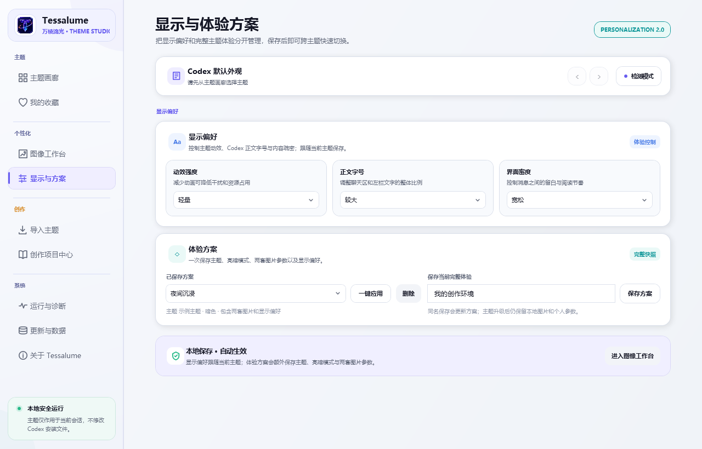
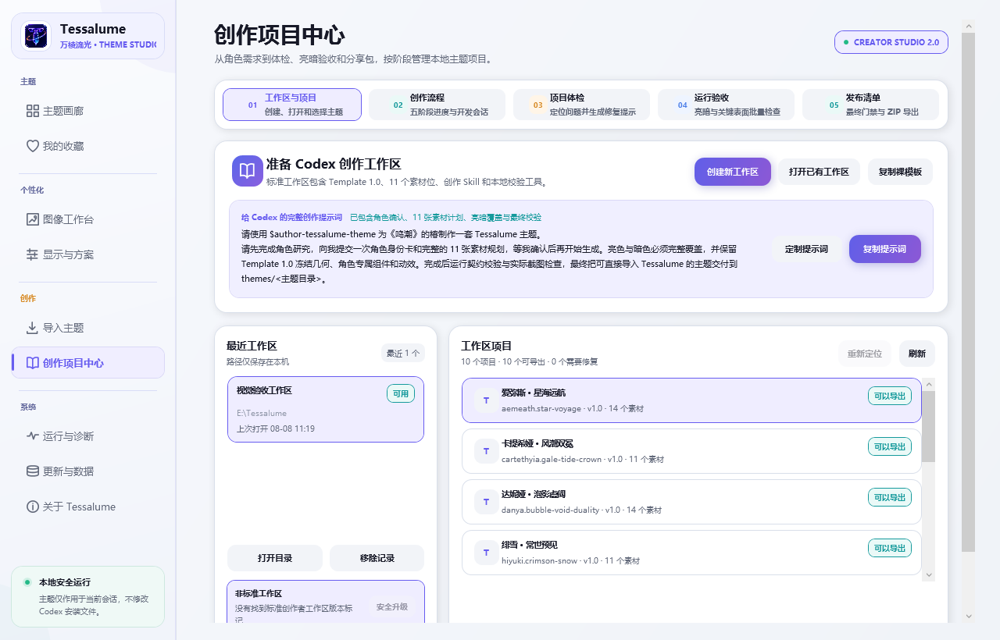

# Tessalume · 万棱流光

**把 Codex Desktop 变成属于你的主题工作空间。**

Tessalume 是一款开源、便携、以本机为中心的 Windows 主题工作室。它不仅能切换配色，还能统一管理首页横幅、左栏、聊天背景、消息框、输入框、角色组件和动效；也能让你直接使用 Codex 创建、体检和导出自己的完整主题。


[下载最新版本](https://github.com/lyc1uckYoo/tessalume/releases/latest) · [查看更新记录](CHANGELOG.md) · [制作主题](THEMING.md) · [反馈问题](https://github.com/lyc1uckYoo/tessalume/issues/new?template=bug-report.yml)

<picture>
  <source media="(prefers-color-scheme: dark)" srcset=".github/assets/screenshots/tessalume-dark.png">
  <source media="(prefers-color-scheme: light)" srcset=".github/assets/screenshots/tessalume-light.png">
  
</picture>

## 一个软件，完成整套主题体验

Tessalume 内置 12 套支持亮色与暗色的完整角色主题，本次新增莫宁·初星穹镜与西格莉卡·语义晨曦。你可以搜索、筛选、收藏和预览主题，再一键应用到 Codex；顶部浮窗则负责日常快速切换、亮暗模式和恢复默认外观。

所有主题与设置都保存在程序所在目录。Tessalume 不修改 Codex 安装文件，不读取聊天内容，也不会替你发送 Codex 任务。

| 能力 | 你可以做什么 |
|---|---|
| **主题画廊** | 管理完整角色主题，查看亮暗预览、主题信息和使用状态，快速收藏、导入与切换。 |
| **图像工作台** | 分别调整首页横幅、左栏图片和聊天背景；亮暗模式独立保存图片、构图、滤镜、遮罩和可读性参数。 |
| **显示偏好** | 为每个主题分别调整动效强度、正文字号与界面密度，让日常阅读更舒适。 |
| **创作项目中心** | 用 Codex 创建主题，并在 Tessalume 中完成项目体检、运行验收、问题修复提示和最终导出。 |
| **兼容与恢复** | 页面变化可通过小型兼容补丁修复；完整更新支持 SHA-256、启动健康检查和上一版本恢复。 |

## 个性化不再需要手改 CSS

首页横幅、左栏人物和聊天背景默认展示主题原图。需要调整时，可以直接修改缩放、位置、亮度、对比度、饱和度、透明度、灰度、色相、柔化、叠色、渐变、暗角和混合模式。每个主题的亮色与暗色参数互不干扰，也可以替换为自己的本地图片。

<picture>
  <source media="(prefers-color-scheme: dark)" srcset=".github/assets/screenshots/tessalume-personalization-dark.png">
  <source media="(prefers-color-scheme: light)" srcset=".github/assets/screenshots/tessalume-personalization-light.png">
  
</picture>

## 让 Codex 帮你制作自己的皮肤

创作项目中心把主题制作拆成清晰的五个阶段：**工作区与项目 → 创作流程 → 项目体检 → 运行验收 → 发布清单**。

你只需要创建工作区，在 Codex 中打开它，然后描述作品和角色。例如：

> 请使用 `$author-tessalume-theme` 为《鸣潮》的椿制作一套 Tessalume 主题；先完成角色研究和 11 张素材计划，等我确认后再生成、校验并交付可导入的主题。

Tessalume 会继续负责结构检查、素材完整性、Template 1.0 契约、亮暗模式和 800 / 1200 / 1800 三档布局验收。存在错误、警告或未完成项目时不会允许导出分享包；需要修改时，还可以生成只针对当前问题的 Codex 修复提示词。



## 三步开始使用

1. 从 [Releases](https://github.com/lyc1uckYoo/tessalume/releases/latest) 下载 `Tessalume.exe` 和 `SHA256SUMS.txt`。
2. 把 EXE 放进一个可写的独立文件夹；如果你正在升级，请直接替换原目录中的旧 EXE。
3. 运行程序，进入主题画廊，选择主题并点击“应用主题到 Codex”。

程序是 Windows x64 自包含单文件，不需要另外安装 .NET。首次启动会在 EXE 旁创建：

```text
Tessalume/
├─ Tessalume.exe
├─ Compatibility/   页面兼容规则
├─ Templates/       创作模板
├─ data/            收藏、设置、状态与备份
└─ themes/          内置主题和用户主题
```

Tessalume 是便携软件。想保留原有数据时，不要把新 EXE 放到另一个空目录；在原目录替换 EXE 即可。

## 更新不会重置你的主题和设置

- 自动更新只替换当前 EXE，不删除 `data/`、`themes/`、个人图片或创作项目。
- 下载完成后必须通过 SHA-256 校验才会安装。
- 更新前会保存上一版 EXE 与旧版可读取的配置快照。
- 新版本未能正常启动时会自动恢复旧版本。
- 更新成功后仍保留一个上一版本恢复点，可在“关于与数据”中手动恢复。
- Codex 页面结构的小变化可以通过独立兼容包修复，不必重新下载完整软件。

从 1.2.x、1.3.x 或 1.4.x 升级到 2.0 时，收藏、主题、个性化参数和创作工作区都会保留；配置会自动迁移到当前格式。

## 本机优先与安全边界

- 主题应用只连接本机 `127.0.0.1` / `::1` 回环端口。
- 不修改 WindowsApps、`app.asar`、Codex 安装目录或 Codex 用户数据。
- 不读取、复制或上传 Codex 对话、日志、账号和设备信息。
- 只有检查软件更新与官方兼容包时会访问本仓库的 GitHub 服务。
- 导入主题时会校验文件清单、路径、体积和远程资源引用。
- 高级主题可以包含视觉脚本，请只导入自己制作或来源明确的主题包。

运行异常时，“运行与诊断”会分别显示 Codex 进程、本机端口、主题包、兼容契约和最近失败阶段，并给出对应恢复建议。

## 系统要求与当前边界

- Windows x64 与 Windows 版 Codex Desktop。
- 当前没有 macOS、Linux 或 ARM64 构建。
- 当前 EXE 没有商业代码签名，首次下载可能触发 Microsoft Defender SmartScreen；请只从本仓库下载并核对 SHA-256。
- 主题运行依赖 Codex Desktop 的本机调试端口。连接异常时请先打开“运行与诊断”，不要手工修改 Codex 安装目录。

## 从源码构建

需要安装 Git、Node.js 与 .NET 8 SDK；主题图片优化依赖 Python 和 Pillow。仓库根目录提供统一构建入口：

```powershell
powershell -ExecutionPolicy Bypass -File ".\一键构建EXE.ps1"
```

脚本会完成依赖还原、格式检查、自动化测试、主题资源优化和 Windows x64 单文件发布，最终产物位于：

```text
dist/portable-win-x64/Tessalume.exe
dist/portable-win-x64/SHA256SUMS.txt
```

项目采用模块化单体结构：

```text
src/Tessalume.App/               WPF 界面、功能视图与更新引导
src/Tessalume.App/Creator/       创作中心的领域、应用、基础设施和表现层
src/Tessalume.App/Compatibility/ 页面兼容运行时源码
src/Tessalume.Core/              主题、备份、兼容、运行时与更新核心
tests/                           产品回归测试和真实更新进程夹具
themes/                          12 套内置主题源码
.agents/skills/                  Codex 主题创作 Skill 与模板
```

主题包契约和开发说明见 [THEMING.md](THEMING.md)，完整版本变化见 [CHANGELOG.md](CHANGELOG.md)，隐私与安全边界见 [SECURITY.md](SECURITY.md)。

## 许可证

Tessalume 程序源码使用 [MIT License](LICENSE)。内置主题涉及的第三方作品名称、角色形象与美术素材仍归原权利人所有，不因本项目许可证获得再授权。
