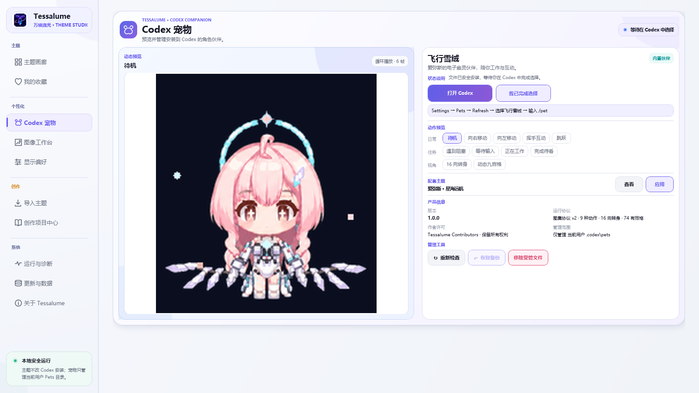

# Tessalume · 万棱流光

**把 Codex Desktop 变成属于你的主题工作空间。**

Tessalume 是一款开源、便携、以本机为中心的 Windows 主题与伴侣工作室。它可以统一管理 Codex 的完整角色主题、三大图像区域、阅读体验与官方 Pets 资产，也能让你直接借助 Codex 创建、体检和导出自己的主题。


[下载最新版本](https://github.com/lyc1uckYoo/tessalume/releases/latest) · [查看更新记录](CHANGELOG.md) · [制作主题](THEMING.md) · [反馈问题](https://github.com/lyc1uckYoo/tessalume/issues/new?template=bug-report.yml)

<picture>
  <source media="(prefers-color-scheme: dark)" srcset=".github/assets/screenshots/tessalume-dark.png">
  <source media="(prefers-color-scheme: light)" srcset=".github/assets/screenshots/tessalume-light.png">
  
</picture>

## 一个软件，完成整套主题体验

Tessalume 内置 12 套同时支持亮色与暗色的完整角色主题。你可以搜索、筛选、收藏和预览主题，再一键应用到 Codex；日常使用时，也能通过顶部浮窗快速切换主题、亮暗模式和默认外观。

| 能力 | 你可以做什么 |
|---|---|
| **主题画廊** | 管理完整角色主题，查看亮暗预览、主题信息和状态，快速收藏、导入与切换。 |
| **图像工作台 3.0** | 分别调整首页横幅、左栏图片和聊天背景；亮暗模式独立保存原图、构图、滤镜与遮罩。 |
| **显示偏好** | 按主题调整动效强度、正文字号与界面密度，让阅读更稳定舒适。 |
| **Codex 宠物** | 预览全部动态动作，安全安装、更新、修复、恢复或卸载当前用户的官方 Pets 资产。 |
| **创作项目中心** | 用 Codex 创建主题，再完成项目体检、运行验收、问题修复提示和最终导出。 |
| **兼容与恢复** | 通过小型兼容补丁适配页面变化；完整更新支持 SHA-256、健康检查与上一版本恢复。 |

所有主题和设置都保存在程序所在目录。Tessalume 不修改 Codex 安装文件，不读取聊天内容，也不会替你发送 Codex 任务。

## 个性化不再需要手改 CSS

图像工作台把 12 套主题原先写死在 CSS 中的裁切、亮度、遮罩和静态变换提取为可版本化的“主题推荐值”。首页横幅、左栏图片和聊天背景在亮暗模式下形成六个独立槽位；每个槽位都可以在主题推荐、真正原图和个人覆盖之间安全切换。

编辑器支持真实页面尺寸、拖动与滚轮缩放、精确 CSS 长度、适合/填充/居中、原图对比、亮度/对比度/饱和度/透明度、叠色、渐变、暗角、混合模式和可读性保护。修改可撤销，恢复只作用于明确的参数或当前槽位，不会连带重置另外两个区域。

<picture>
  <source media="(prefers-color-scheme: dark)" srcset=".github/assets/screenshots/tessalume-personalization-dark.png">
  <source media="(prefers-color-scheme: light)" srcset=".github/assets/screenshots/tessalume-personalization-light.png">
  
</picture>

## Codex 宠物，仍然保持本机边界

宠物中心内置首只角色伙伴“飞行雪绒”，可以逐项预览待机、移动、交互、任务状态和 16 向转身等 11 组动态动作。Tessalume 只管理当前用户 `.codex\pets` 中的官方 Pets 文件，安装前校验清单和 SHA-256，覆盖前保留备份，并提供修复、恢复和受管卸载。

Tessalume 不会启动独立桌宠进程，不读取 Codex 对话、账号或日志；安装后仍由你在 Codex 的 Settings → Pets 中完成选择。

<picture>
  <source media="(prefers-color-scheme: dark)" srcset=".github/assets/screenshots/tessalume-pets-dark.png">
  <source media="(prefers-color-scheme: light)" srcset=".github/assets/screenshots/tessalume-pets-light.png">
  
</picture>

## 让 Codex 帮你制作自己的皮肤

创作项目中心把主题制作拆成 **工作区与项目 → 创作流程 → 项目体检 → 运行验收 → 发布清单** 五个阶段。你可以在 Codex 中打开准备好的工作区，然后直接描述作品和角色：

> 请使用 `$author-tessalume-theme` 为《鸣潮》的椿制作一套 Tessalume 主题；先完成角色研究和 11 张素材计划，等我确认后再生成、校验并交付可导入的主题。

Tessalume 会检查结构、素材、Template 1.0 契约、亮暗模式和响应式布局；错误、警告或未完成验收会阻止导出分享包，并能生成只针对当前问题的 Codex 修复提示词。


## 三步开始使用

1. 从 [Releases](https://github.com/lyc1uckYoo/tessalume/releases/latest) 下载 `Tessalume.exe` 和 `SHA256SUMS.txt`。
2. 把 EXE 放进一个可写的独立文件夹；升级时直接替换原目录中的旧 EXE。
3. 运行程序，在主题画廊选择主题并点击“应用主题到 Codex”。

程序是 Windows x64 自包含单文件，不需要另外安装 .NET。首次启动会在 EXE 旁创建 `Compatibility/`、`Templates/`、`data/`、`themes/` 和宠物资源目录。

## 更新不会重置你的主题和设置

- 自动更新只替换 `Tessalume.exe`，不会删除 `data/`、`themes/`、个人图片、宠物备份或创作项目。
- 下载完成后必须通过 SHA-256 校验；新版本还要提交启动健康确认，否则自动恢复旧版。
- 更新前会保存上一版 EXE 与旧版可读取的配置快照，成功后仍保留一个手动恢复点。
- Codex 页面结构的小变化可以通过独立兼容包修复，不必重新下载完整软件。

从 2.0.2 升级到 2.1.0 时，Schema 5 配置会先原样备份，再迁移为 Schema 7。收藏、最近主题、亮暗图像参数、本地图片路径、动效/字号/密度、创作草稿和工作区记录都会保留；已经移出产品的旧方案字段不会继续写回。

## 本机优先与安全边界

- 主题应用只连接本机 `127.0.0.1` / `::1` 回环端口。
- 不修改 WindowsApps、`app.asar`、Codex 安装目录或 Codex 用户数据。
- 不读取、复制或上传 Codex 对话、日志、账号和设备信息。
- 只有检查软件更新与官方兼容包时会访问本仓库的 GitHub 服务。
- 导入主题与宠物资产时会校验文件清单、路径、体积和哈希；高级主题仍应只使用来源明确的脚本。

## 系统要求与当前边界

- Windows x64 与 Windows 版 Codex Desktop；当前没有 macOS、Linux 或 ARM64 构建。
- EXE 暂无商业代码签名，首次下载可能触发 Microsoft Defender SmartScreen；请只从本仓库下载并核对 SHA-256。
- 主题运行依赖 Codex Desktop 的本机调试端口；异常时请先打开“运行与诊断”。

## 从源码构建

需要 Git、Node.js、.NET 8 SDK，以及用于主题图片优化的 Python 和 Pillow：

```powershell
powershell -ExecutionPolicy Bypass -File ".\一键构建EXE.ps1"
```

脚本会完成还原、格式检查、自动化测试、主题资源优化和 Windows x64 单文件发布，产物位于 `dist/portable-win-x64/`。

项目采用模块化单体结构：WPF 功能视图位于 `src/Tessalume.App/Features/`，主题、宠物、兼容、备份和更新核心位于 `src/Tessalume.Core/`，页面运行时位于 `src/Tessalume.App/Compatibility/Runtime/`，完整回归位于 `tests/`。

主题包契约见 [THEMING.md](THEMING.md)，版本变化见 [CHANGELOG.md](CHANGELOG.md)，隐私与安全边界见 [SECURITY.md](SECURITY.md)。

## 许可证

Tessalume 程序源码使用 [MIT License](LICENSE)。内置主题与宠物涉及的第三方作品名称、角色形象和美术素材仍归原权利人所有，不因本项目许可证获得再授权。
