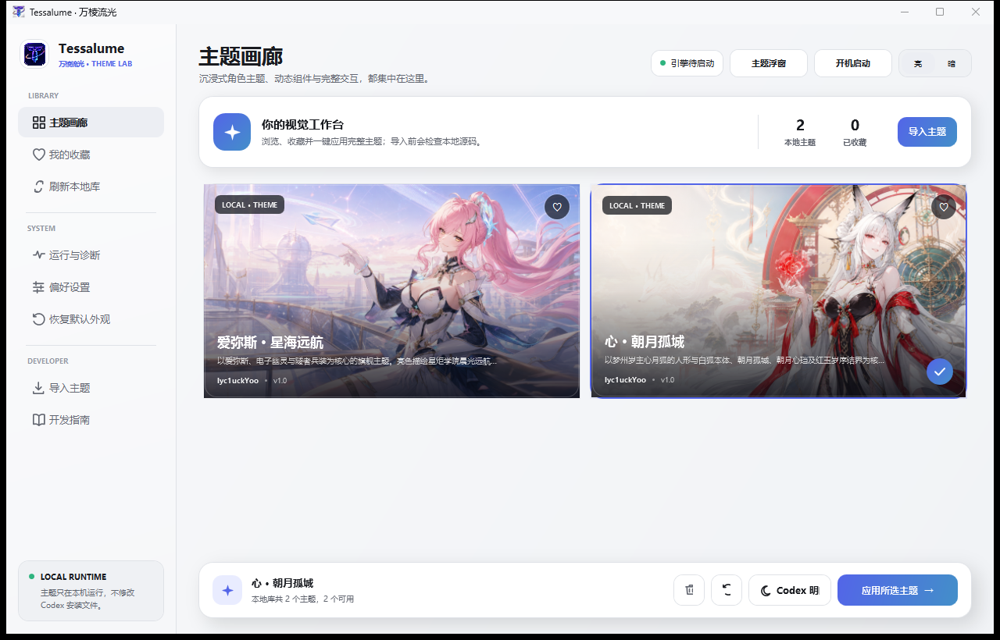
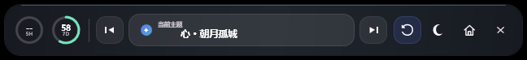
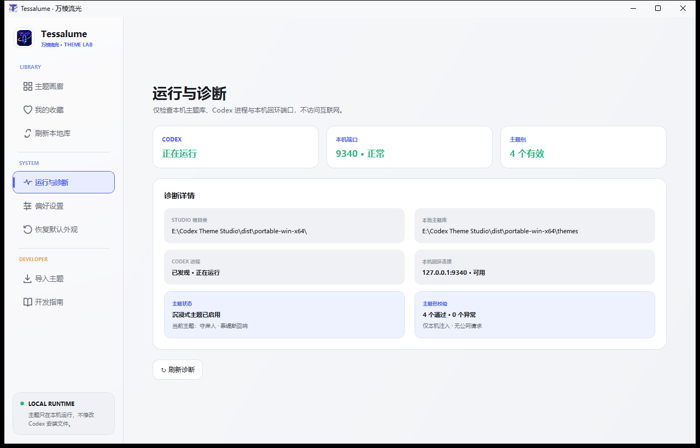

# Tessalume · 万棱流光

面向 Codex Desktop 的开源 Windows 主题工作室。Tessalume 把完整沉浸式主题、亮暗模式、收藏切换、额度信息和本机诊断集中在一个便携应用中；它通过本机回环端口连接 Codex，不修改 Codex 安装包、`app.asar` 或用户数据。

[下载 Tessalume 1.2](https://github.com/lyc1uckYoo/tessalume/releases/latest) · [版本记录](CHANGELOG.md) · [主题制作指南](THEMING.md) · [旗舰主题模板 1.0](examples/README.md)

<picture>
  <source media="(prefers-color-scheme: dark)" srcset="docs/screenshots/tessalume-dark.png">
  <source media="(prefers-color-scheme: light)" srcset="docs/screenshots/tessalume-light.png">
  
</picture>

## Tessalume 1.2

1.2 把 Tessalume 从主题工具进一步整理为一致的产品工作台：主题画廊支持按名称、作者、ID 和亮暗能力搜索筛选；确认弹窗、错误说明与操作完成提示采用统一视觉；新增“关于与数据”页面，集中显示版本、便携目录和本地主题状态。高级图像调节继续按主题、区域和 Codex 亮暗模式独立保存，默认展示原图。

## 主要功能

- **完整主题画廊**：统一管理角色横幅、聊天背景、消息框、卡片、输入框挂件和专属动效，不只是替换颜色。
- **十套内置旗舰主题**：10 款主题全部随 EXE 发布，均支持亮色和暗色，并遵循同一套 Template 1.0 结构、自适应规则与运行时契约。
- **主题搜索与筛选**：可按名称、说明、作者或主题 ID 搜索，并按亮色/暗色支持能力快速筛选主题与收藏。
- **收藏与快速切换**：收藏喜欢的主题，在主界面或顶部浮窗中直接切换；恢复默认外观后，也可以一键回到刚才使用的主题。
- **Codex 明暗模式控制**：Tessalume 自身和 Codex 的亮暗模式分别控制，浮窗会显示 Codex 当前状态。
- **高级图像调节**：首页横幅、左栏人物和聊天背景可分别调整亮度、对比度、饱和度与不透明度；每个主题的亮色和暗色参数独立保存，默认保持原图。
- **本地主题导入**：导入包含 `manifest.json`、`skin.css`、`theme.js` 和本地资源的完整主题包；也可以从软件内释放并复制旗舰模板开始制作。
- **一句话主题创作**：从“主题创作”页准备自包含的 Codex 创作者工作区；在 Codex 中打开后，只需说出作品与角色，即可启动研究、11 张素材规划、制作和契约校验流程。
- **便携数据与开机启动**：主题、收藏、运行状态和界面设置都保存在 `Tessalume.exe` 旁边；开机启动只写入当前 Windows 用户，不需要管理员权限，并可迁移清理旧品牌启动项。
- **恢复与诊断**：随时移除已注入的主题并恢复 Codex 默认外观；诊断页会检查 Codex 进程、本机端口、主题包和当前运行状态，顶部状态与实际主题引擎保持同步。
- **单实例续接**：重复运行 `Tessalume.exe` 不会创建第二套后台状态，而是唤起已经运行的主界面。

## 顶部主题浮窗

Tessalume 默认以顶部浮窗开始工作。浮窗常驻屏幕上方，不遮挡 Codex 的主要内容，提供：

- Codex **5 小时额度**与**长周期额度**剩余比例，信息可用时每分钟刷新；
- 上一个、下一个主题切换：有收藏时仅在收藏主题间切换，没有收藏时使用全部有效主题；
- 当前主题和运行状态；
- 恢复 Codex 默认外观，或重新应用刚才使用的主题；
- Codex 亮色/暗色切换；
- 打开 Tessalume 主界面与关闭浮窗。



如果 Codex 暂时没有返回某个额度，圆环会显示 `--`，不会阻塞主题切换。点击浮窗中的主页按钮，或再次运行 `Tessalume.exe`，即可打开完整主题画廊。

## 当前内置主题

| 主题 | 包 ID | 亮暗形态与主题特征 |
|---|---|---|
| 爱弥斯 · 星海远航 | `aemeath.star-voyage` | 星炬学院晨光 / 隧者核心深空，包含机制同步面板与专属长剑「永远的启明星」 |
| 卡提希娅 · 风潮双冕 | `cartethyia.gale-tide-crown` | 游侠逐风 / 芙露德莉斯解放形态，以风潮王冠、三柄剑影、黑潮荆棘和鸢尾花瓣构成双形态组件 |
| 达妮娅 · 泡影虚阈 | `danya.bubble-void-duality` | 泡泡剧场伪装形态 / 寂静虚阈真形，保留双形态角色组件与专属动效 |
| 绯雪 · 常世预见 | `hiyuki.crimson-snow` | 晨雪守愿 / 冰蓝预见，包含愿望档案、常世与预见双卡、预见铃阵及迅刀「霙霜」 |
| 尤诺 · 月弦逆命 | `iuno.moonbow-defiance` | 新月月弓 / 弦月月环，以四方殿星历、月相历盘与逆写命运构成完整视觉系统 |
| 清宵 · 云门剑境 | `qingxiao.cloudsword-gate` | 行剑云关 / 抚弦布阵，包含天地弦心剑、万剑归弦、云门剑痕消息框与玉案记忆组件 |
| 守岸人 · 泰缇斯回响 | `shorekeeper.tethys-reverie` | 镜海晨曦 / 概率之海，包含潮汐演算、双卡交替与专武「星序协响」 |
| 穗穗 · 朝晖山水卷 | `suisui.inkscape-dawn` | 朝晖山河长卷 / 夜色水墨境，包含栖霞饮露扇、重明双卡、昆明记忆水镜与流金消息框 |
| 心 · 朝月孤城 | `xin.moonfox-sovereign` | 白玉云宫 / 赤月黑城，人形与白狐本体、红玉岁序结界和双角色卡交替动效 |
| 秧秧 · 苍翎远音 | `yangyang.xuanling-echo` | 温柔清雪 / 玄方夜战，包含苍翎六音、苍剑与翎剑式、秧秧和玄翎鸟双卡及风轨动效 |

10 款内置主题的主题包版本与旗舰模板契约均为 `1.0`，同时支持亮色与暗色。程序根据 Tessalume 当前模式自动使用对应预览，应用后可以直接在浮窗中切换 Codex 明暗形态。

## 下载与使用

1. 从 [Releases](https://github.com/lyc1uckYoo/tessalume/releases/latest) 下载 `Tessalume.exe`。
2. 将 EXE 放入一个可写的独立文件夹，不要直接在压缩包或临时下载目录中运行。
3. 运行 `Tessalume.exe`。程序是包含 .NET 运行时的 Windows x64 自包含单文件，不需要另行安装 .NET。
4. 首次启动会在程序旁创建并维护以下便携目录：

   ```text
   Compatibility/   本机主题运行适配
   Templates/       旗舰主题模板 1.0
   data/            收藏、运行状态与界面设置
   themes/          内置主题和自行导入的主题
   ```

5. 首次启动会先显示欢迎引导，不会自动应用主题或中断正在运行的 Codex。进入主题库后，由你选择想使用的主题。
6. 在主界面选择主题并点击“应用主题到 Codex”。需要重新启动 Codex 时，软件会先提醒保存当前工作并等待确认；连接成功后即可通过浮窗实时切换。

发布页同时提供 `SHA256SUMS.txt`，可用于核对下载的 EXE。Tessalume 1.2 当前面向安装了 Windows 版 Codex Desktop 的 x64 系统。

## 本机运行与安全边界

Tessalume 的主题运行链路保持在本机：

- 只发现和连接 `127.0.0.1` / `::1` 回环端口，不提供账号、云同步、主题商店或远程主题下载；
- 不修改 WindowsApps、Codex 安装文件、`app.asar` 或 Codex 用户数据；
- 导入时校验清单、入口文件、资源路径、扩展名与大小，拒绝路径越界和 CSS 远程资源；
- 主题运行时根据完整包内容识别当前加载版本，切换和恢复均在当前本机会话内完成；
- 删除主题只作用于 Tessalume 自己的本地主题库；删除正在使用的主题前会先恢复 Codex 默认外观。



诊断页区分 Codex 进程、本机端口、有效主题数量、当前主题和包校验结果，便于判断问题发生在主题包、Codex 启动还是本机连接阶段。

## 制作与导入主题

普通用户推荐从软件内的“主题创作”页面开始。点击“准备 Codex 创作工作区”，
选择保存位置，然后在 Codex 中打开整个 `Tessalume-Creator` 文件夹并发送一句话，
例如“请为《鸣潮》的椿制作一套 Tessalume 主题”。Codex 会先展示角色身份卡和
11 张素材计划，确认后完成制作与校验；最终从工作区的 `themes/<主题目录>` 导入。

从 [旗舰主题模板 1.0](examples/README.md) 开始。模板以 `心 · 朝月孤城` 为冻结几何基准，统一首页横幅、左侧主卡、记忆卡、右侧双卡、同步面板、聊天宽度和输入框挂件位置；主题作者只替换角色图片、文案、配色、纹样、符号和专属动效。

仓库内所有高级主题共用 canonical host：运行时负责路由检测、页面注入、消息与输出面板标记、自适应显隐和清理；主题包只负责自己的视觉与动画。完整包规范、安全限制和生命周期见 [THEMING.md](THEMING.md)，可执行脚手架与校验流程见 [.agents/skills/author-tessalume-theme](.agents/skills/author-tessalume-theme/SKILL.md)。

导入包的最小结构：

```text
my-character-theme/
├─ manifest.json
├─ skin.css
├─ theme.js
└─ assets/
```

## 从源码构建

在 PowerShell 中运行仓库根目录唯一的一键构建脚本：

```powershell
powershell -ExecutionPolicy Bypass -File ".\一键构建EXE.ps1"
```

脚本会根据 `global.json` 和项目配置自动完成：

1. 准备匹配的 .NET SDK；
2. 还原依赖、编译并运行全部自动检查；
3. 增量优化内置主题图片并生成画廊预览；
4. 发布 Windows x64 自包含单文件 EXE；
5. 完整替换 `dist/portable-win-x64`。

默认产物为 `dist/portable-win-x64/Tessalume.exe`。构建只收集 `themes/` 的一级主题目录，以及各主题根清单明确声明的入口、预览和资源；设计源文件、历史副本和未声明文件不会进入发布 EXE。

## 项目结构

```text
src/Tessalume.App       WPF 主界面、顶部浮窗与本机适配
src/Tessalume.Core      主题加载、校验、Codex 启动与 CDP 运行时
tests/                         无外部测试框架的自动检查
schemas/                       主题包 JSON Schema
themes/<主题目录>/             10 款内置旗舰主题源码
examples/                      可直接复制的旗舰主题模板 1.0
.agents/skills/                主题创作规范、脚手架与契约校验
docs/screenshots/              Tessalume 实机界面截图
一键构建EXE.ps1               还原、测试、优化与发布入口
```

Tessalume 1.2 的正式发布产物为 `Tessalume.exe` 与对应的 SHA-256 校验文件，不额外要求安装器或 .NET 运行环境。
